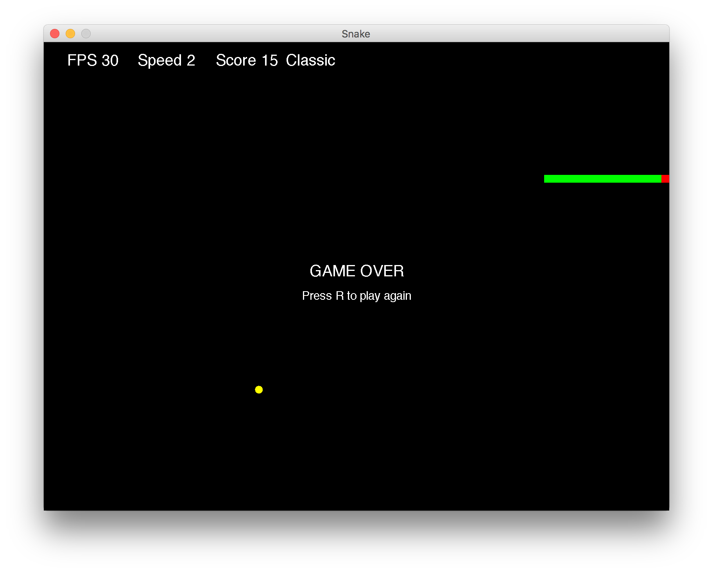

# Snake

This is a Java version of the classic Snake game, and also my submission for CS349 Assignment 1 (Spring 2016)
This version allows the player to cap the framerate, increase/decrease the game speed, and play either the classic mode or advanced mode.

## Screenshots

## Setup

To compile this program, simply run 'make' in the root directory.
You can run this program with 'java Snake <FRAME_RATE> <GAME_SPEED>', where FRAME_RATE is an integer argument ranging from 1-100, and GAME_SPEED is an integer argument ranging from 1-10.
Alternatively, you can run this program by typing 'make run' which will start the game with a default framerate of 30, and speed of 2.

## Controls

Upon starting the game, you will be presented with a splash screen detailing various options.
To quit the game, press Q at any point while the program is running.
At the splash screen, press either 1 for classic mode, or 2 for advanced mode.
Press p to pause or unpause the game.
And press R to restart the game.

When a game begins, the player starts in the centre of the screen, and begins moving in a random direction.
The player begins as one square and must use the arrow keys or WASD keys to move the snake around and eat the fruit.
Eating a fruit grows the player by one square, and the player must be careful not to crash into obstacles (or the snake itself!)
Each fruit nets 1 point, and the game never ends (unless you fill up the whole screen!)

## Classic mode

In this mode, the boundaries of the screen are walls that the player must avoid.
The goal is simple, eat as much fruit as you can without crashing the snake!

## Advanced mode

In addition to the classic mode rules, in this mode, crossing the boundaries of the screen will move the player to the opposite side of the screen.
Furthermore, there are obstacles at each corner of the screen which the player must avoid.

## Development environment

This game was developed with Java 8 update 81 on Mac OSX 10.11.3

